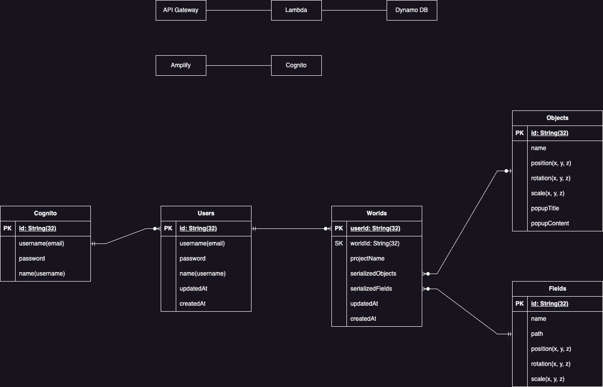

<h1 align="center">Porcraft✨</h1>
<h3 align="center">公式サイト：　<a href="https://porcraft.com/">porcraft.com</a></h3>
<p align="center">
    　
    
<p align="center">
  
</p>
</p>

## Overview

Porcraft is designed to allow users to add 3D objects and move, resize, and customize them within a scene. Users can also export their finished 3D models for use in other software or to share on the web.

## 概要

Porcraft は、ユーザーが 3D オブジェクトを追加し、シーン内を移動、サイズ変更、カスタマイズできるように設計されています。また、完成した 3D モデルをエクスポートし、他のソフトウェアで使用したり、ウェブ上で共有することができます。

## Architecture
<p align="center">
    
</p>

## Infrastructure

<p align="center">
    
</p>

## Features

- ✨ 新規登録/ログイン機能(途中)
- ✨ 3Dモデルレンダリング
- ✨ 3Dモデルエクスポート
- ✨ 作成したサイトにて公開（途中）
- ✨ 3Dモデルインポート（途中）

## Contributors

<table>
  <tbody>
    <tr>
      <td align="center" valign="top" width="14.28%"><a href="https://github.com/YoungmanCH"><br />
      <sub><b>✨Tsubasa Youngman</b></sub></a><br />
        Engineer/PM
      </td>
      <td align="center" valign="top" width="14.28%"><a href="https://github.com/MORIMOTO520212"><br />
      <sub><b>Yuma Morimoto</b></sub></a><br />
        Advisor
      </td>
      <td align="center" valign="top" width="14.28%"><a href="https://github.com/char5742"><br />
      <sub><b>Mr.Fujino</b></sub></a><br />
        Advisor
      </td>
      <td align="center" valign="top" width="14.28%"><a href="https://github.com/ichiro16go"><br />
      <sub><b>Ichiro</b></sub></a><br />
        Engineer
      </td>
      <td align="center" valign="top" width="14.28%"><a href="https://github.com/shotaro1412"><br />
      <sub><b>Shotaro</b></sub></a><br />
        Engineer
      </td>
    </tr>

  </tbody>
</table>

## License

Reusing the all design, code of the application without permission is prohibited.


<br>

## ライセンス

アプリ上の Design, Code を許可なく転用することを禁止します。

<br>

## Usage
リポジトリをクローンし、依存関係をインストールします。

```
git clone https://github.com/YoungmanCH/PORCRAFT.git
cd porcraft
npm install
```


開発サーバーの起動
以下のコマンドで開発サーバーを起動します。

`npm run dev`
ブラウザで http://localhost:5173 にアクセスして、アプリを確認します。

ビルド
プロジェクトをビルドするには、以下のコマンドを使用します。

`npm run build`
