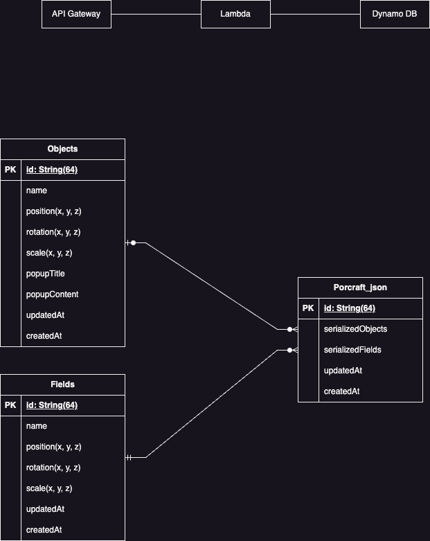
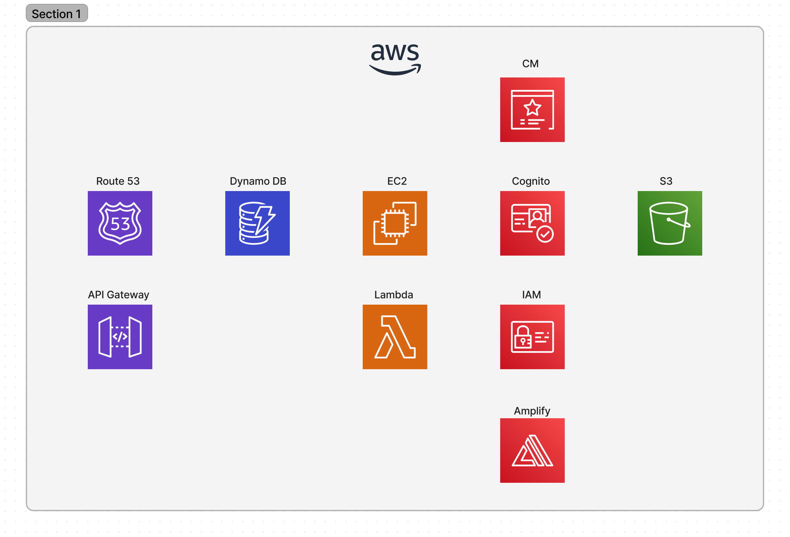

# Porcraft

<p align="center">
    　
    
</p>
<p align="center">
  
</p>

Porcraft is a revolutionary web application that allows you to create stunning 3D portfolios instantly. Unlike traditional 2D portfolios, Porcraft enables you to express your identity and introduce yourself or your team in a visually immersive way.

## Key Features

- ✨ Account Registration/Login
- ✨ 3D Model Rendering
- ✨ 3D Model Export
- ✨ Publish on Created Sites
- ✨ 3D Model Import (Under Development)
- ✨ AI-Generated Model Import (Under Development)

### Instant 3D Rendering

Porcraft allows you to render 3D models instantly, making it easy to create a vivid representation of your identity and professional persona. Whether you're an engineer, designer, game programmer, or hobbyist, Porcraft helps you showcase your unique style and skills.

### Personalized Worldviews

Express your identity effortlessly with Porcraft:

- **Engineer**: Build a futuristic cityscape with robots and AI, reflecting a modern, tech-savvy world.
- **Designer**: Create artistic environments centered around unique, creative designs.
- **Game Programmer**: Immerse yourself in a fantasy realm with dragons and magical landscapes.
- **Running Enthusiast**: Design a simple, human-centric city environment.
- **Music Lover**: Set the stage in a live house with plenty of spotlights.

### Unique Portfolio Creation

Users can combine 3D objects from their unique perspective to create a one-of-a-kind portfolio. This differentiation helps you effectively highlight your skills and creativity, making a strong impression on viewers.

### Interactive Experience

Porcraft offers an interactive experience that sets it apart from traditional text or image-based portfolios. Visitors can engage with your 3D creations, making your portfolio more memorable and impactful.

### No Technical Skills Required

As a no-code platform, Porcraft allows users without programming skills to easily create and publish 3D models. This reduces technical barriers and encourages more people to participate in 3D content creation.

### New Means of Self-Expression

Porcraft provides a new way to express yourself. Professionals from various fields, such as engineers, designers, and game programmers, can represent their expertise and hobbies in a 3D world.

### Community Connectivity

Projects created with Porcraft can be shared via social media, enhancing connections with like-minded communities. This sharing can lead to valuable feedback and new collaboration opportunities.

## Conclusion

Porcraft is more than just an application; it’s a fusion of creativity and technology. It offers a platform where users can freely express their identity and worldview, fostering creativity and personal growth. Whether you aim to showcase your professional skills or personal interests, Porcraft is a valuable tool for anyone looking to make a lasting impression.

## Architecture

<p align="center">
    
</p>

## Infrastructure

<p align="center">
    
</p>

## Contributors

<table>
  <tbody>
    <tr>
      <td align="center" valign="top" width="14.28%"><a href="https://github.com/YoungmanCH"><br />
      <sub><b>✨Tsubasa Youngman</b></sub></a><br />
        Engineer/PM
      </td>
      <td align="center" valign="top" width="14.28%"><a href="https://github.com/MORIMOTO520212"><br />
      <sub><b>Yuma Morimoto</b></sub></a><br />
        Advisor
      </td>
      <td align="center" valign="top" width="14.28%"><a href="https://github.com/char5742"><br />
      <sub><b>Mr. Fujino</b></sub></a><br />
        Advisor
      </td>
      <td align="center" valign="top" width="14.28%"><a href="https://github.com/ichiro16go"><br />
      <sub><b>Ichiro</b></sub></a><br />
        Engineer
      </td>
      <td align="center" valign="top" width="14.28%"><a href="https://github.com/shotaro1412"><br />
      <sub><b>Shotaro</b></sub></a><br />
        Engineer
      </td>
    </tr>
  </tbody>
</table>

## License

Reusing all design and code of the application without permission is prohibited.

## Usage

Clone the repository and install dependencies:

```bash
git clone https://github.com/YoungmanCH/PORCRAFT.git
cd porcraft
npm install
```

<br>

Start the development server:

```bash
npm run dev
```

After running the above command, open your browser and navigate to http://localhost:5173 to see the application in action.